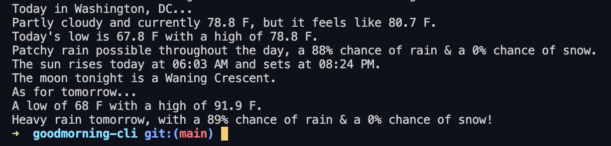

# goodmorning-cli

## A simple CLI command to get your day started!

---

## How to get started

First, run `npm install goodmorning-cli`  
Then run `goodmorning world`  

That's it!

## Contributing

Please let me know if you have any ideas for additional features you would like to see!
